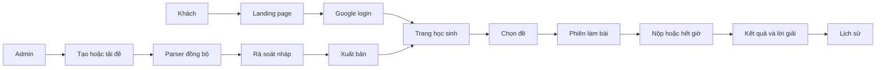
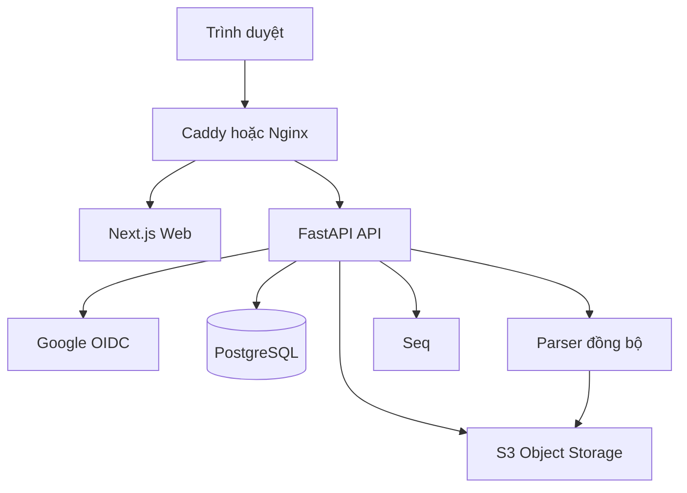

# SPEC — Ứng dụng ôn thi Lịch sử THPT

> Trạng thái: bản đặc tả đầu vào đã được tách thành tài liệu sản phẩm tại
> `docs/product/`, gói user story tại `docs/story-packet.md`, và kế hoạch thực
> thi tại `docs/plans/active/initial-delivery.md`. Những tài liệu đó là nguồn sự
> thật cho công việc tiếp theo; file này được giữ làm snapshot quyết định ban đầu.

## 1. Mục tiêu

Xây dựng ứng dụng web giúp học sinh Việt Nam ôn thi Lịch sử THPT qua đề trắc
nghiệm có giới hạn thời gian, chấm điểm tự động, lời giải chi tiết và lịch sử học
tập. Admin quản lý, nhập và xuất bản đề thi.

Không thuộc phạm vi phiên bản đầu: thanh toán, lớp học/giáo viên, chấm tự luận,
thi đấu thời gian thực, AI sinh nội dung và ứng dụng mobile native.

## 2. Người dùng và phân quyền

- **Khách:** xem trang giới thiệu và đề đã xuất bản; cần đăng nhập để làm bài.
- **Học sinh:** đăng nhập Google, chọn/làm/nộp đề, xem điểm-lời giải, xem lịch sử và làm lại.
- **Admin:** email Google thuộc allowlist; tạo, nhập, rà soát, xuất bản và
  archive đề; quản lý tài sản.

Vai trò admin được backend kiểm tra trên mọi API. Người dùng không thể tự yêu
cầu hoặc nâng quyền.

## 3. Quy tắc nghiệp vụ

- Đề có trạng thái `draft`, `in_review`, `published`, `archived`. Chỉ đề `published` được chọn để làm.
- Mỗi lần làm bài (`attempt`) có trạng thái `in_progress`, `submitted`, hoặc `expired_and_submitted`.
- Khi bắt đầu, backend gắn attempt với một `exam_version` cố định và tạo `expires_at`. Đồng hồ trình duyệt chỉ để hiển thị; backend quyết định hết hạn.
- Học sinh được làm lại không giới hạn. Mỗi attempt chỉ dùng một lần nộp và dữ liệu lịch sử không đổi khi đề bị sửa.
- Mọi câu có trọng số bằng nhau; điểm là `round(số_câu_đúng / tổng_số_câu × 10, 2)`. Không có điểm âm.
- Học sinh xem đáp án đúng và giải thích ngay sau khi nộp hoặc hết giờ; dữ liệu này không được trả về trước đó.
- Phiên bản đầu không trộn câu hỏi/lựa chọn.
- Xóa đề, câu hỏi và asset là xóa mềm khi còn liên quan tới attempt hoặc audit log.

## 4. Luồng chính



## 5. User story và tiêu chí chấp nhận

### US-01 — Trang giới thiệu

Là khách, tôi muốn xem giới thiệu và đề nổi bật để biết ứng dụng có phù hợp trước khi đăng nhập.

Tiêu chí chấp nhận:
- Hiển thị sứ mệnh, CTA “Làm đề ngay”, điều hướng Danh sách đề và Đăng nhập Google.
- Chỉ hiển thị đề `published`; không hiện đáp án, lời giải hoặc tệp nguồn.
- CTA của khách đưa tới đăng nhập Google và quay về trang/đề đang chọn sau khi
  xác thực.
- Sử dụng được trên mobile và desktop.

### US-02 — Đăng nhập Google

Là học sinh, tôi muốn đăng nhập Google để lưu tiến độ và lịch sử.

Tiêu chí chấp nhận:
- Có đăng nhập/đăng xuất qua Google OAuth/OIDC.
- Lần đầu tạo một hồ sơ nội bộ gắn với Google `sub`; các lần sau không tạo trùng.
- Lỗi xác thực không tạo session và không lộ secret/thông tin kỹ thuật.
- Session hết hạn hoặc logout khiến API xác thực bị từ chối và đưa người dùng về
  trang đăng nhập.

### US-03 — Phân quyền admin

Là chủ hệ thống, tôi muốn chỉ định email admin trước để học sinh không tự nâng quyền.

Tiêu chí chấp nhận:
- Email trong allowlist nhận role `admin`; các tài khoản khác là `student`.
- API admin từ non-admin bị chặn tại backend.
- Thêm/xóa allowlist có audit log gồm actor, thời gian, email và hành động.

### US-04 — Tìm và chọn đề

Là học sinh, tôi muốn tìm đúng đề cần ôn.

Acceptance criteria:
- Danh sách chỉ trả phiên bản đề `published` hiện hành.
- Có tìm theo tiêu đề, lọc theo chủ đề/giai đoạn, năm, mức độ và phân trang.
- Thẻ đề có tiêu đề, mô tả ngắn, số câu, thời lượng, chủ đề và trạng thái đã/chưa làm.
- Trang chi tiết không lộ đáp án/lời giải trước khi nộp.

### US-05 — Bắt đầu làm đề

Là học sinh, tôi muốn bắt đầu đề với thời lượng cố định.

Acceptance criteria:
- Nút bắt đầu tạo attempt với `exam_version`, `started_at` và `expires_at`.
- Backend tính thời điểm hết hạn; đổi giờ thiết bị không kéo dài thời gian làm.
- Mỗi học sinh chỉ có một attempt đang làm cho cùng một đề; mở lại sẽ tiếp tục attempt còn hạn.
- Trước khi bắt đầu, hệ thống hiển thị số câu và thời lượng.

### US-06 — Trả lời và tự lưu

Là học sinh, tôi muốn trả lời đề và không bị mất tiến độ khi tải lại trang.

Acceptance criteria:
- Mỗi câu có nội dung, tối thiểu hai lựa chọn và ảnh nếu có; chỉ chọn tối đa một đáp án.
- Có điều hướng câu, số câu đã/chưa trả lời và đánh dấu xem lại.
- Đáp án tự lưu; refresh/đăng nhập trên thiết bị khác phục hồi dữ liệu nếu attempt còn hạn.
- Nếu lưu lỗi, giao diện hiển thị trạng thái chưa lưu và cho phép thử lại.
- Không thể đọc/sửa attempt của người khác.

### US-07 — Đồng hồ và hết giờ

Là học sinh, tôi muốn biết chính xác thời gian còn lại và bài được xử lý đúng khi hết giờ.

Acceptance criteria:
- Đồng hồ dùng `expires_at` từ backend.
- Đến hạn, UI khóa sửa đáp án; backend từ chối mọi thay đổi sau hạn kể cả người dùng offline.
- Backend đóng và chấm bài bằng các đáp án lưu gần nhất.
- Giao diện phân biệt hết giờ với lỗi hệ thống.

### US-08 — Nộp bài và xem kết quả

Là học sinh, tôi muốn biết điểm và lý do đúng/sai sau khi nộp.

Acceptance criteria:
- Trước nộp hiển thị số câu chưa trả lời và yêu cầu xác nhận; vẫn cho phép nộp.
- Submit idempotent: gửi lại không tạo thêm lượt nộp hoặc thay đổi điểm.
- Kết quả có số đúng/sai/bỏ trống, điểm thang 10 và thời gian dùng.
- Mỗi câu hiển thị đáp án đã chọn, đáp án đúng, trạng thái và giải thích.
- Đáp án/lời giải chỉ khả dụng khi attempt đã hoàn thành.

### US-09 — Lịch sử và làm lại

Là học sinh, tôi muốn theo dõi tiến bộ và làm lại đề.

Acceptance criteria:
- Lịch sử của chính học sinh sắp xếp mới nhất trước, có đề, thời điểm, điểm và số câu đúng.
- Chi tiết kết quả giữ nguyên khi admin sửa đề về sau.
- Làm lại tạo attempt mới theo phiên bản `published` hiện hành.
- Không thể xem lịch sử/kết quả của tài khoản khác.

### US-10 — Tạo đề thủ công

Là admin, tôi muốn tạo và sửa đề trực tiếp.

Acceptance criteria:
- Tạo đề nháp với tiêu đề, mô tả, chủ đề, năm, mức độ, thời lượng và câu hỏi.
- Câu hợp lệ có nội dung, từ hai lựa chọn, đúng một đáp án đúng và lời giải.
- Có thêm/sửa/xóa mềm/sắp xếp câu hỏi và lựa chọn trong nháp.
- Sửa đề đã publish tạo phiên bản nháp mới, không ghi đè dữ liệu dùng để chấm attempt cũ.

### US-11 — Upload tài sản

Là admin, tôi muốn tải tệp nguồn và ảnh minh họa của đề.

Acceptance criteria:
- Chấp nhận DOCX/PDF cho tệp nguồn; JPEG/PNG/WebP cho ảnh.
- Kiểm tra MIME type, phần mở rộng, dung lượng và checksum trước khi liên kết asset.
- Tệp lưu S3-compatible object storage; database chỉ lưu metadata và object key.
- Tệp nguồn chỉ admin truy cập; ảnh đề published chỉ phân phối cho người được xem câu hỏi.

### US-12 — Parser đồng bộ

Là admin, tôi muốn import tài liệu để giảm nhập đề thủ công.

Acceptance criteria:
- Chỉ admin truy cập import; parser chạy đồng bộ trong request và trả kết quả rõ ràng.
- Hỗ trợ DOCX/PDF có text layer. PDF scan/chỉ ảnh trả lỗi “chưa hỗ trợ OCR”.
- Parser trích tiêu đề, câu hỏi, lựa chọn, đáp án và lời giải khi nhận diện được; trường không chắc chắn phải có cảnh báo, không tự suy diễn.
- Tệp quá 20 MB hoặc xử lý quá 120 giây bị dừng an toàn, không làm hỏng dữ liệu đang có.
- Kết quả chỉ tạo/cập nhật nháp, không tự publish.

### US-13 — Rà soát và publish

Là admin, tôi muốn kiểm tra nháp parser trước khi công khai đề.

Acceptance criteria:
- Có màn hình hiển thị tệp nguồn, dữ liệu trích xuất và mọi cảnh báo.
- Admin sửa được toàn bộ metadata, câu hỏi, lựa chọn, đáp án và lời giải.
- Publish bị chặn khi dữ liệu không hợp lệ, với lỗi theo trường/câu.
- Khi publish, đề xuất hiện cho học sinh; attempt cũ tiếp tục dùng phiên bản cũ.
- Publish, archive, đổi đáp án và import tạo audit log.

## 6. Mô hình dữ liệu

- `users`: Google `sub`, email, tên, ảnh, trạng thái, lần đăng nhập cuối.
- `admin_allowlist` hoặc `user_roles`: quyền admin tách hồ sơ.
- `exams`, `exam_versions`: đề, metadata, lifecycle và lịch publish.
- `questions`, `question_options`, `question_explanations`: nội dung theo phiên bản đề.
- `attempts`, `attempt_answers`, `attempt_results`: snapshot đề, đáp án, hạn nộp và điểm.
- `assets`: object key, MIME type, kích thước, checksum, liên kết đề/câu.
- `import_jobs`, `import_findings`: tệp import, kết quả parser, cảnh báo.
- `audit_logs`: actor, hành động, đối tượng, thời gian và thông tin thay đổi cần thiết.

## 7. Kiến trúc repo và triển khai

Kiến trúc được chốt là monorepo gồm Next.js frontend, FastAPI backend, PostgreSQL và Docker Compose để triển khai VPS. Python/FastAPI phù hợp tốc độ xây dựng luồng quản trị và hệ sinh thái DOCX/PDF.



- Cấu trúc repository:

  ```text
  apps/
    web/                 # Next.js, React, TypeScript
  services/
    api/                 # FastAPI, SQLAlchemy, Alembic, parser
  infra/
    caddy/               # reverse proxy và TLS
  docs/
  compose.yml
  .env.example
  SPEC.md
  ```

- Frontend: Next.js App Router, React và TypeScript. Landing page dùng SSR/SSG; các màn hình học sinh/admin gọi REST API.
- Backend: FastAPI REST API với prefix `/v1`, OpenAPI, SQLAlchemy và Alembic. Backend là nguồn sự thật cho authentication, RBAC, timer và chấm điểm.
- Routing cùng origin: Caddy/Nginx phục vụ `/v1/*` tới FastAPI và các đường dẫn còn lại tới Next.js. Cách này tránh CORS và giữ session cookie trên một domain.
- Google login: FastAPI xử lý OAuth/OIDC callback, tạo hồ sơ/role nội bộ và phát session cookie `HttpOnly`, `Secure`, `SameSite=Lax`. Next.js không tự tạo session thứ hai.
- Database: PostgreSQL là nguồn dữ liệu duy nhất; migration chỉ qua Alembic.
- Deploy VPS: Docker Compose chạy các service `proxy`, `web`, `api` và `db`. Google OAuth, S3-compatible object storage và Seq là các dịch vụ ngoài VPS hoặc được cấu hình độc lập.
- Object storage: Amazon S3 hoặc Cloudflare R2-compatible S3, dùng presigned URL.
- Không dùng Redis/RabbitMQ/worker trong phiên bản đầu. Chỉ thêm job nền khi số liệu cho thấy parser đồng bộ không đáp ứng.

## 8. Phi chức năng và bảo mật

- 95% API thông thường phản hồi dưới 1 giây khi không parser; parser có giới hạn 120 giây/tệp 20 MB.
- Lỗi parser không làm ảnh hưởng API làm bài; health check phản ánh PostgreSQL và object storage.
- TLS bắt buộc; secret không nằm trong source/log; rate limit endpoint nhạy cảm.
- Lưu Google `sub` làm định danh thay vì email; session cookie phải `HttpOnly`, `Secure` và `SameSite` phù hợp.
- Phân quyền phải được thực thi server-side; presigned URL ngắn hạn.
- Backup PostgreSQL mỗi ngày, thử khôi phục trên staging định kỳ; bucket có versioning/lifecycle.
- Trước production phải công bố Điều khoản sử dụng và Chính sách bảo mật, bao gồm dữ liệu Google tối thiểu, thời hạn lưu lịch sử và cơ chế yêu cầu xóa dữ liệu.

## 9. Tiêu chí phát hành

Phát hành khi toàn bộ acceptance criteria có test tự động hoặc bằng chứng UAT. Không phát hành nếu có lỗi làm lộ đáp án trước khi nộp, cho phép vượt quyền admin, sai điểm, hoặc làm mất/sai lịch sử làm bài.
