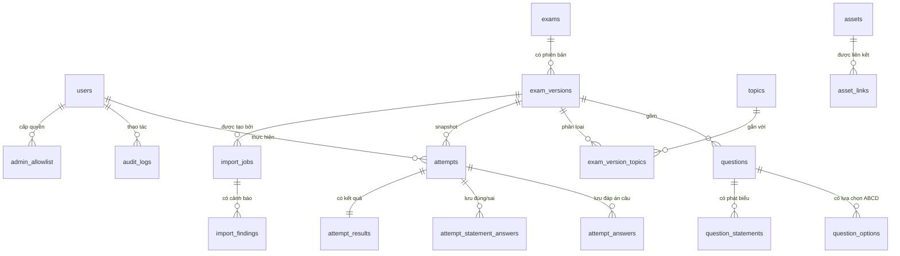

# Database schema

## Mục đích

Tài liệu này là thiết kế dữ liệu triển khai được cho Điểm 10 Lịch sử. Nó bổ sung
cho [decision 0003](decisions/0003-database-identity-and-topic-taxonomy.md):
decision ghi lựa chọn bền vững, còn tài liệu này định nghĩa bảng, quan hệ, index
và ràng buộc cần có.

PostgreSQL là hệ thống dữ liệu chính. Mọi khóa chính dùng `uuid`; thời điểm dùng
`timestamptz`; dữ liệu thay đổi theo domain không được xóa cứng khi vẫn còn liên
kết tới attempt hoặc audit log.

## Sơ đồ quan hệ

## Quy ước chung

- Mọi bảng nghiệp vụ có `id uuid primary key`.
- Bảng có thể chỉnh sửa dùng `created_at`, `updated_at`; bảng lịch sử thêm
`deleted_at` khi cần xóa mềm.
- Status được kiểm tra bằng `check constraint`; không chỉ dựa vào validation
API.
- Email được lưu lowercase sau khi Google xác minh trong `varchar`; `google_subject`
là định danh bất biến của user.
- Không lưu blob tệp trong PostgreSQL. R2 là nơi lưu object; database chỉ lưu
metadata/object key.

## 1. Định danh và kiểm toán

### `users`

| Cột                        | Kiểu           | Ràng buộc                 | Mục đích                  |
| -------------------------- | -------------- | ------------------------- | ------------------------- |
| `id`                       | `uuid`         | PK                        | Định danh nội bộ          |
| `google_subject`           | `varchar(255)` | unique, not null          | Google OIDC `sub`         |
| `email`                    | `varchar(320)` | unique, not null          | Email Google đã chuẩn hóa |
| `display_name`             | `varchar(255)` | not null                  | Tên hiển thị              |
| `avatar_url`               | `text`         | nullable                  | Ảnh đại diện              |
| `status`                   | `varchar(20)`  | check `active`/`disabled` | Khóa tài khoản khi cần    |
| `created_at`, `updated_at` | `timestamptz`  | not null                  | Theo dõi thay đổi         |

### `admin_allowlist`

| Cột                | Kiểu           | Ràng buộc            | Mục đích                        |
| ------------------ | -------------- | -------------------- | ------------------------------- |
| `id`               | `uuid`         | PK                   | Định danh hàng                  |
| `email`            | `varchar(320)` | unique, not null     | Email được cấp quyền admin      |
| `added_by_user_id` | `uuid`         | FK `users`, nullable | Admin đã cấp quyền              |
| `created_at`       | `timestamptz`  | not null             | Thời điểm cấp                   |
| `revoked_at`       | `timestamptz`  | nullable             | Thu hồi quyền không mất lịch sử |

Unique index chỉ áp dụng với email có `revoked_at is null`.

### `audit_logs`

| Cột                         | Kiểu              | Ràng buộc            | Mục đích                   |
| --------------------------- | ----------------- | -------------------- | -------------------------- |
| `id`                        | `uuid`            | PK                   | Định danh event            |
| `actor_user_id`             | `uuid`            | FK `users`, nullable | Người/tác nhân thực hiện   |
| `action`                    | `varchar(100)`    | not null, indexed    | Ví dụ `exam.publish`       |
| `target_type`, `target_id`  | `varchar`, `uuid` | indexed              | Tài nguyên bị tác động     |
| `request_id`                | `uuid`            | indexed              | Liên kết log request       |
| `ip_address`                | `inet`            | nullable             | Điều tra thao tác nhạy cảm |
| `before_data`, `after_data` | `jsonb`           | nullable             | Snapshot đã lọc secret/PII |
| `created_at`                | `timestamptz`     | not null             | Thời điểm event            |

Index chính: `(target_type, target_id, created_at desc)` và
`(actor_user_id, created_at desc)`.

## 2. Taxonomy và nội dung đề

### `topics`

| Cột          | Kiểu           | Ràng buộc             | Mục đích                     |
| ------------ | -------------- | --------------------- | ---------------------------- |
| `id`         | `uuid`         | PK                    | Định danh topic              |
| `slug`       | `varchar(160)` | unique, not null      | URL/filter ổn định           |
| `name`       | `varchar(255)` | unique, not null      | Tên hiển thị                 |
| `parent_id`  | `uuid`         | FK `topics`, nullable | Phân cấp giai đoạn/chuyên đề |
| `sort_order` | `integer`      | not null              | Thứ tự hiển thị              |
| `is_active`  | `boolean`      | not null              | Ẩn taxonomy cũ an toàn       |

### `exams`

`exams` là định danh ổn định cho một đề. Nội dung công khai không nằm tại đây để
sửa đề không làm thay đổi attempt cũ.

| Cột                                      | Kiểu           | Ràng buộc             |
| ---------------------------------------- | -------------- | --------------------- |
| `id`                                     | `uuid`         | PK                    |
| `slug`                                   | `varchar(160)` | unique, not null      |
| `created_by_user_id`                     | `uuid`         | FK `users`            |
| `created_at`, `updated_at`, `deleted_at` | `timestamptz`  | `deleted_at` nullable |

### `exam_versions`

| Cột                        | Kiểu                     | Ràng buộc                                     |
| -------------------------- | ------------------------ | --------------------------------------------- |
| `id`                       | `uuid`                   | PK                                            |
| `exam_id`                  | `uuid`                   | FK `exams`, not null                          |
| `version_number`           | `integer`                | unique cùng `exam_id`, lớn hơn 0              |
| `status`                   | `varchar(20)`            | `draft`, `in_review`, `published`, `archived` |
| `title`, `summary`         | `varchar(255)`, `text`   | not null                                      |
| `year`, `difficulty`       | `integer`, `varchar(50)` | `year` nullable                               |
| `duration_minutes`         | `integer`                | lớn hơn 0                                     |
| `published_at`             | `timestamptz`            | bắt buộc khi published                        |
| `created_by_user_id`       | `uuid`                   | FK `users`                                    |
| `created_at`, `updated_at` | `timestamptz`            | not null                                      |

Ràng buộc quan trọng:

- `unique (exam_id, version_number)`.
- Partial unique index `exam_id where status = 'published'` để chỉ một version
công khai hoạt động.
- Index public discovery: `(status, published_at desc)`.

### `exam_version_topics`

Bảng liên kết cho phép một đề tổng hợp thuộc nhiều chủ đề mà không làm mất
taxonomy chuẩn hóa.

| Cột               | Kiểu      | Ràng buộc          |
| ----------------- | --------- | ------------------ |
| `exam_version_id` | `uuid`    | FK `exam_versions` |
| `topic_id`        | `uuid`    | FK `topics`        |
| `is_primary`      | `boolean` | not null           |

Khóa chính ghép: `(exam_version_id, topic_id)`. Chỉ một topic chính mỗi version
qua partial unique index `exam_version_id where is_primary`.

### `questions`, `question_options` và `question_statements`

`questions` thuộc một `exam_version`. Câu Phần I dùng `question_options` cho
bốn lựa chọn ABCD. Câu Phần II dùng `question_statements` cho bốn phát biểu
Đúng/Sai và lưu đoạn tư liệu trên chính `questions`.

| Bảng                 | Cột cốt lõi                                                                                          | Ràng buộc                                            |
| -------------------- | ---------------------------------------------------------------------------------------------------- | ---------------------------------------------------- |
| `questions`          | `id`, `exam_version_id`, `position`, `part_number`, `part_position`, `question_type`, `body`, `source_text`, `explanation` | unique `(exam_version_id, position)`, unique `(exam_version_id, part_number, part_position)`, `position > 0`, `part_number in (1, 2)` |
| `question_options`   | `id`, `question_id`, `position`, `body`, `is_correct`                                                | unique `(question_id, position)`, `position > 0`     |
| `question_statements` | `id`, `question_id`, `position`, `body`, `is_correct`                                               | unique `(question_id, position)`, `position > 0`     |

Quy tắc publish cần validation service vì phụ thuộc nhiều hàng: đề mới phải có
24 câu `multiple_choice` ở Phần I và 4 câu `true_false_group` ở Phần II. Mỗi câu
Phần I có đúng bốn lựa chọn và một đáp án đúng. Mỗi câu Phần II có `source_text`
và đúng bốn phát biểu, mỗi phát biểu có đáp án boolean.

## 3. Lượt làm bài và kết quả

Các bảng này chưa có trong migration đầu nhưng là điều kiện để hoàn thành
US-05 đến US-09.

### `attempts`

| Cột                                                     | Kiểu          | Ràng buộc                                                        |
| ------------------------------------------------------- | ------------- | ---------------------------------------------------------------- |
| `id`                                                    | `uuid`        | PK                                                               |
| `user_id`                                               | `uuid`        | FK `users`, not null                                             |
| `exam_version_id`                                       | `uuid`        | FK `exam_versions`, not null                                     |
| `status`                                                | `varchar(30)` | `in_progress`, `submitted`, `expired_and_submitted`, `abandoned` |
| `started_at`, `expires_at`, `paused_at`, `submitted_at` | `timestamptz` | `expires_at > started_at`; hai cột sau nullable                   |
| `attempt_number`                                        | `integer`     | lớn hơn 0                                                        |

Partial unique index `(user_id, exam_version_id) where status = 'in_progress'`
ngăn hai attempt mở cùng phiên bản. Để ngăn hai attempt mở theo hai version của
cùng exam, service cần kiểm tra theo `exams.id` trong transaction.

`paused_at` ghi thời điểm người dùng rời màn hình làm bài. Khi tiếp tục,
`expires_at` được cộng thêm khoảng `now - paused_at`, sau đó `paused_at` trở lại
`null`.

### `attempt_answers`

| Cột                    | Kiểu          | Ràng buộc                       |
| ---------------------- | ------------- | ------------------------------- |
| `attempt_id`           | `uuid`        | FK `attempts`                   |
| `question_id`          | `uuid`        | FK `questions`                  |
| `selected_option_id`   | `uuid`        | FK `question_options`, nullable |
| `is_marked_for_review` | `boolean`     | not null                        |
| `updated_at`           | `timestamptz` | not null                        |

Khóa chính ghép: `(attempt_id, question_id)`.

### `attempt_statement_answers`

| Cột              | Kiểu          | Ràng buộc                         |
| ---------------- | ------------- | --------------------------------- |
| `attempt_id`     | `uuid`        | FK `attempts`                     |
| `question_id`    | `uuid`        | FK `questions`                    |
| `statement_id`   | `uuid`        | FK `question_statements`          |
| `selected_value` | `boolean`     | nullable để biểu diễn bỏ trống    |
| `updated_at`     | `timestamptz` | not null                          |

Khóa chính ghép: `(attempt_id, statement_id)`. Service đảm bảo
`statement_id` thuộc `question_id` và `question_id` thuộc snapshot attempt.

### `attempt_results`

| Cột                                                    | Kiểu           | Ràng buộc        |
| ------------------------------------------------------ | -------------- | ---------------- |
| `attempt_id`                                           | `uuid`         | PK/FK `attempts` |
| `correct_count`, `incorrect_count`, `unanswered_count` | `integer`      | không âm         |
| `part1_score`, `part2_score`, `score`                  | `numeric(4,2)` | từ 0 đến 10      |
| `graded_at`                                            | `timestamptz`  | not null         |

Kết quả được lưu một lần khi nộp/hết giờ; không chấm lại sau khi admin thay đổi
version đề.

### `attempt_question_results`

| Cột                                                        | Kiểu           | Ràng buộc                      |
| ---------------------------------------------------------- | -------------- | ------------------------------ |
| `attempt_id`                                               | `uuid`         | FK `attempts`                  |
| `question_id`                                              | `uuid`         | FK `questions`                 |
| `part_number`, `correct_count`, `total_count`              | `integer`      | không âm                       |
| `earned_score`, `max_score`                                | `numeric(4,2)` | không âm                       |

Khóa chính ghép: `(attempt_id, question_id)`. Bảng này là snapshot breakdown
để trang kết quả không cần chấm lại.

## 4. Tài sản và parser

### `assets`

| Cột                        | Kiểu           | Ràng buộc                           |
| -------------------------- | -------------- | ----------------------------------- |
| `id`                       | `uuid`         | PK                                  |
| `object_key`               | `text`         | unique, not null                    |
| `bucket`                   | `varchar(255)` | not null                            |
| `mime_type`                | `varchar(255)` | not null                            |
| `size_bytes`               | `bigint`       | lớn hơn 0                           |
| `checksum_sha256`          | `char(64)`     | not null, indexed                   |
| `asset_kind`               | `varchar(30)`  | `source_document`, `question_image` |
| `uploaded_by_user_id`      | `uuid`         | FK `users`                          |
| `created_at`, `deleted_at` | `timestamptz`  | `deleted_at` nullable               |

### `asset_links`

Liên kết tài sản với `exam_versions` hoặc `questions`. Cần ràng buộc application
để một hàng chỉ tham chiếu đúng một loại owner; tránh polymorphic FK không được
PostgreSQL bảo vệ.

| Cột               | Kiểu                                |
| ----------------- | ----------------------------------- |
| `asset_id`        | `uuid` FK `assets`                  |
| `exam_version_id` | `uuid` FK `exam_versions`, nullable |
| `question_id`     | `uuid` FK `questions`, nullable     |
| `purpose`         | `varchar(30)`                       |

### `import_jobs` và `import_findings`

| Bảng              | Cột cốt lõi                                                                                                              |
| ----------------- | ------------------------------------------------------------------------------------------------------------------------ |
| `import_jobs`     | `id`, `source_asset_id`, `exam_version_id`, `status`, `requested_by_user_id`, `started_at`, `completed_at`, `error_code` |
| `import_findings` | `id`, `import_job_id`, `severity`, `field_path`, `message`, `raw_value`, `resolved_at`, `resolved_by_user_id`            |

Status import: `running`, `succeeded`, `failed`, `timed_out`. Output parser chỉ
tạo/cập nhật draft; không có status tự publish.

## Lộ trình migration

1. **Sửa migration gốc trước khi dùng môi trường chung:** UUID native, topics,
  ràng buộc version/status và timestamp chuẩn.
2. **Migration identity:** hoàn thiện users, allowlist và audit metadata cho
  US-02/US-03.
3. **Migration attempt:** attempts, answers, results cho US-05 đến US-09.
4. **Migration content intake:** assets, import jobs/findings cho US-10 đến
  US-13.

## Quyết định còn mở

- Có cần multi-topic ngay từ bản đầu hay chỉ `is_primary` topic? Thiết kế hiện
tại hỗ trợ cả hai nhưng UI có thể giới hạn một lựa chọn lúc đầu.
- Có cần thu hồi session trên toàn thiết bị? Nếu có, thêm bảng `sessions` với
token hash và `revoked_at`; nếu không, session cookie ký là đủ cho bản đầu.
- Chính sách retention cụ thể cho audit log, assets xóa mềm và dữ liệu học sinh
cần được chốt trước production.

